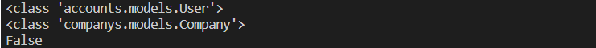

### 단일 유저모델과 다중 유저모델을 구현할 때 주의할 점

User Model이 하나일 경우, 현재 로그인하고 있는 pk값 자체는 User Database에 저장된 pk값으로 저장되게 됩니다. 이로인한 예시로는 아래와 같습니다.

만약 좋아요 기능을 구현하는 예시를 아래에 하겠습니다.

```python
@api_view(['POST'])
def like_article(request, article_pk):
    article = get_object_or_404(Article, pk=article_pk)
    user = request.user
    if article.like_users.filter(pk=user.pk).exists():
        article.like_users.remove(user)
        serializer = ArticleSerializer(article)
        return Response(serializer.data)
    else:
        article.like_users.add(user)
        serializer = ArticleSerializer(article)
        return Response(serializer.data)
```


위의 코드에서 아래와 같은 부분을 살펴본다면

```
if article.like_users.filter(pk=user.pk).exists():
```

현재 로그인 중인 user의 pk값을 그대로 가져와서 사용합니다.


다중 유저모델을 구현하고 해당하는 pk 값을 불러오기 위해서는 여러가지 상황에 대한 이해가 필요합니다.

다중 유저모델 구현에 있어서, one to one related Fields가 필요하며 login은 user의 pk 값을 통해 구현됩니다.


다중 모델은 user의 DB에서 user.pk값이 one to one 매칭 되는 DB와 연결되게 됩니다.

따라서 Academy의 대한 DB의 자동으로 생성되는 pk값과 user.pk값이 다릅니다.


이러한 오류를 범하게 되면, 현재 로그인 중인 Academy에 관련된 정보를 찾기 위해서는 

Academy DB에 해당하는 Academy의 pk 값은 현재 User의 pk 값과 다르게 매칭됩니다.

따라서 이를 해결하기 위해서는 아래와 같은 코드를 작성해야지 정상적으로 동작되게 됩니다.

```
if article.like_users.filter(academy_id = user.pk).exists():
```


### 다중 유저 모델 사용 시, 현재 요청을 보내는 유저와 게시글 소유자가 같은지 확인법


기존 단일 유저모델 사용 때와 같이

```python
if request.user == education.academy:
    pass
```

위의 코드를 작성하여 단순히 확인하였지만, 계속해서 오류가 발생했습니다.


`print()`를 통해 값을 확인해보았지만, 값은 정상적으로 잘 나왔습니다.

하지만 type을 확인한 순간 잘못된 부분을 알 수 있었습니다



다음과 같이 class 형태로 이루어져 있어서 if 결과 값이 False로 반환되고 있었습니다.


```python
if str(request.user) == str(education.academy):
    pass
```

두 개 모두 클래스가 다를 뿐, 같은 값이기에 str로 감싸주어 오류를 해결하였습니다.
